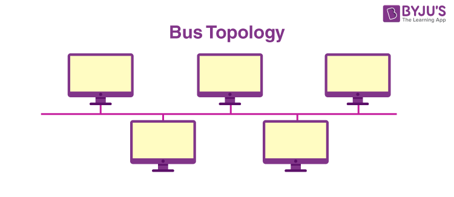

# 🌐 Network Topology

## 📌 Introduction

**Network Topology** is the arrangement or layout of devices, cables, and connections in a network.

It explains:

- How devices are connected
- How data moves between devices
- How network communication is organized

---

# Types of Network Topology

## 1. Physical Topology

Physical topology describes the **actual physical arrangement** of network devices and cables.

Examples:

- Cable placement
- Router and switch locations
- Device connections

Example:

Home network cable arrangement.

---

## 2. Logical Topology

Logical topology describes **how data flows between devices** regardless of physical arrangement.

It explains:

- Data transmission method
- Communication path
- Network behavior

---

# 🔌 Physical Port vs Logical Port

## Physical Port

A physical port is a hardware connection point on a device.

Examples:

- USB port
- HDMI port
- Ethernet port

---

## Logical Port

A logical port is a software-based communication endpoint used by network services.

Examples:

- HTTP → Port 80
- HTTPS → Port 443
- SSH → Port 22

---

# 🚌 Bus Topology

## Definition

In Bus topology, all devices are connected to a single main cable called a **backbone cable**.

