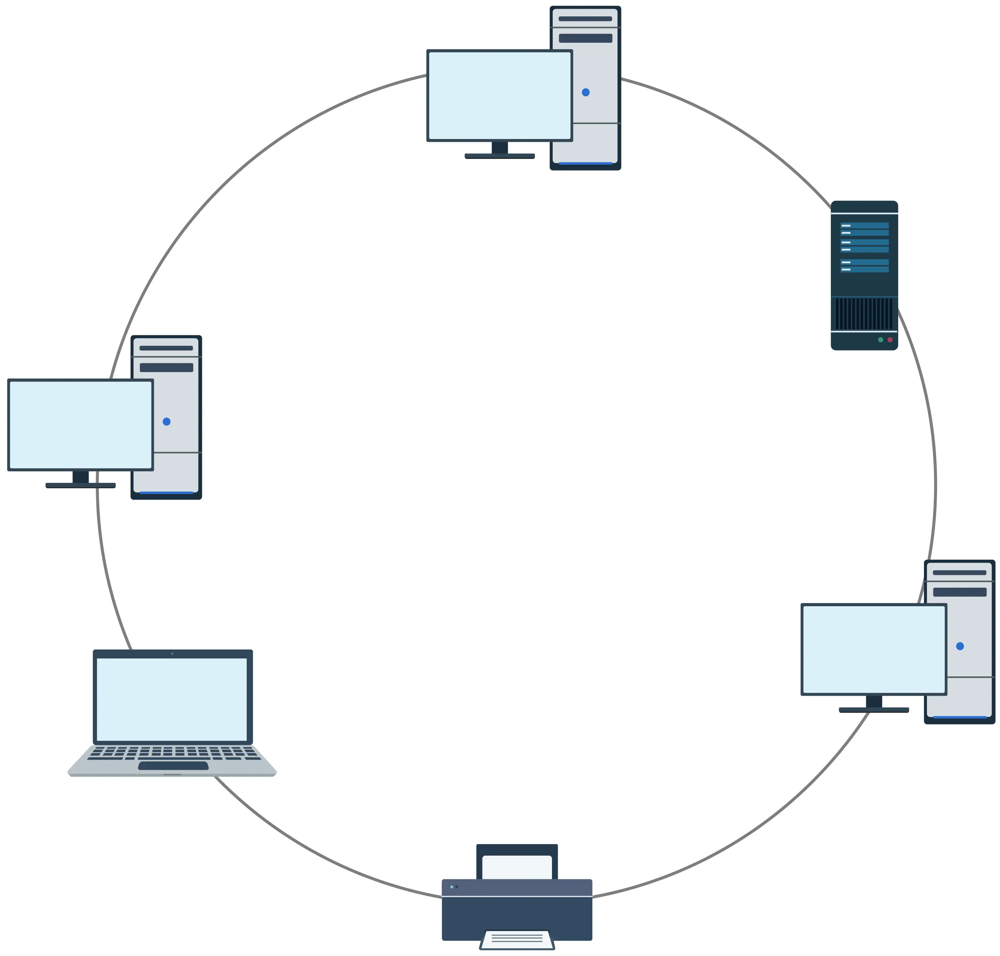
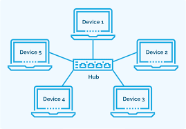
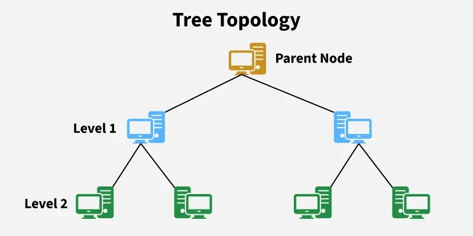

# 🌐 Network Topology

## 📌 Introduction

**Network Topology** is the arrangement or layout of devices, cables, and connections in a network.

It explains:

- How devices are connected
- How data moves between devices
- How network communication is organized

---

# Types of Network Topology

## 1. Physical Topology

Physical topology describes the **actual physical arrangement** of network devices and cables.

Examples:

- Cable placement
- Router and switch locations
- Device connections

Example:

Home network cable arrangement.

---

## 2. Logical Topology

Logical topology describes **how data flows between devices** regardless of physical arrangement.

It explains:

- Data transmission method
- Communication path
- Network behavior

---

# 🔌 Physical Port vs Logical Port

## Physical Port

A physical port is a hardware connection point on a device.

Examples:

- USB port
- HDMI port
- Ethernet port

---

## Logical Port

A logical port is a software-based communication endpoint used by network services.

Examples:

- HTTP → Port 80
- HTTPS → Port 443
- SSH → Port 22

---

# 🚌 Bus Topology

## Definition

In Bus topology, all devices are connected to a single main cable called a **backbone cable**.

## Advantages:

✅ Low cost  
✅ Requires less cable  
✅ Simple installation  
✅ Easy to extend for small networks  

## Disadvantages:

❌ If the main cable fails, the entire network stops  
❌ Performance decreases when more devices are added  
❌ Difficult to locate faults  
❌ Less secure  
❌ Not suitable for large networks  

---

# 🔄 Ring Topology

## Definition

In Ring topology, devices are connected in a circular structure.

Data travels in an organized direction from one device to another.

## Advantages:

✅ Orderly data transmission  
✅ Equal access for all devices  
✅ Good performance under heavy load  
✅ Easier fault identification compared to bus topology  

## Disadvantages:

❌ Failure of one connection can affect the network  
❌ Slower for small networks compared to star topology  
❌ Troubleshooting can be difficult  

---

# ⭐ Star Topology

## Definition

In Star topology, every device connects to a central device such as a:

- Switch
- Hub

## Advantages:

✅ Failure of one device does not affect others  
✅ Easy to manage  
✅ Easy troubleshooting  
✅ High performance with switches  

## Disadvantages:

❌ If the central device fails, the entire network stops  
❌ Requires more cables  
❌ Cost increases with more devices and ports  

---

# 🕸️ Mesh Topology

## Definition

In Mesh topology, every device is connected to multiple or all other devices.

Types:

- Full Mesh
- Partial Mesh

## Advantages:

✅ Extremely reliable  
✅ High security  
✅ Multiple communication paths  
✅ Easy fault detection  

## Disadvantages:

❌ Requires many cables and ports  
❌ Expensive  
❌ Complex design  
❌ Difficult maintenance  

---

# 🔀 Hybrid Topology

## Definition

Hybrid topology combines two or more different topologies.

Examples:

- Star + Bus
- Star + Ring

## Advantages:

✅ Combines benefits of multiple topologies  
✅ Flexible and expandable  
✅ Reliable  
✅ Can be optimized for different requirements  

## Disadvantages:

❌ Expensive  
❌ Complex design  
❌ Difficult troubleshooting  
❌ Requires skilled network professionals  

---

# 🌳 Tree Topology

## Definition

Tree topology has a hierarchical structure.

The first device is called the:

**Root Node**

Other connected devices are:

**Child Nodes**

## Advantages:

✅ Easy management  
✅ Easy expansion  
✅ Suitable for large organizations  
✅ Adding new branches does not affect other sections  

## Disadvantages:

❌ Failure of root device affects the entire network  
❌ Complex structure  
❌ Requires proper management  

---

# 🛡️ Network Topology and Cybersecurity

Security teams analyze topology to:

- Understand network structure
- Detect unusual traffic
- Identify weak points
- Monitor communication paths
- Improve network security

SOC analysts use:

- Event Viewer
- SIEM tools
- Network monitoring tools

to analyze security events and detect suspicious activities.

---

# 📊 Topology Comparison

| Topology | Reliability | Cost | Complexity |
|---|---|---|---|
| Bus | Low | Low | Simple |
| Ring | Medium | Medium | Medium |
| Star | High | Medium | Easy |
| Mesh | Very High | High | Complex |
| Hybrid | High | High | Complex |
| Tree | Medium | Medium | Complex |

---

# ⭐ Key Concept
Physical Topology → How devices are physically connected

Logical Topology → How data flows between devices
