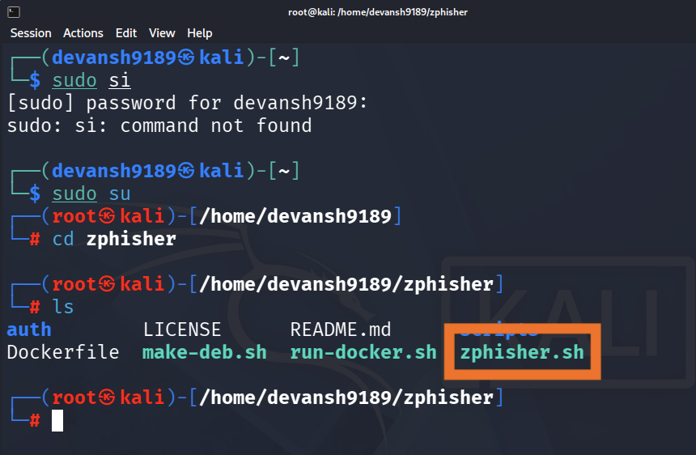
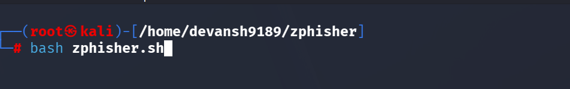
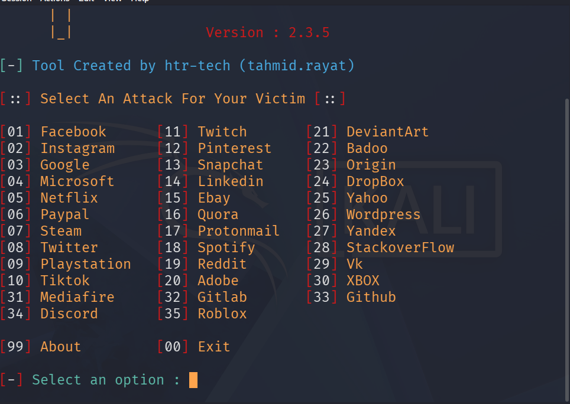

## ⚠️ Disclaimer: Only for Educational purposes. 
---

## 💣 Phishing Attack using Zphisher Tool 

We will create a simulated login page environment using a pre-built template to understand how phishing attacks work and how attackers attempt to trick users into entering credentials. This will help in learning about phishing techniques and developing better security awareness and defenses.

---

# Getting Pre-built Templates:
First, we need ready-made login pages for faster execution. To achieve this, we will use a GitHub project that contains pre-built login page templates that are ready to use. This will save development time and allow us to focus on further implementation and testing. 
``` bash
git clone --depth=1 https://github.com/htr-tech/zphisher.git
```
This has all pre-built templates.

# 🖥️ Open Kali-linux Terminal
## 1: Get User Access
To get user access we use command:
```
sudo su
```
Once you enter the provided credentials, you will be prompted to enter your Kali Linux username and password. While typing the password, no characters will be displayed on the terminal, which is a normal security feature in Linux systems.

After entering the correct password, you will gain access to the user's directory and see the command prompt with your username. If the password is incorrect, the system will display a "Permission denied" message.
## 2: 🔀Cloning the Pre-built Templates into your system
In the terminal, copy and paste the GitHub repository link and press Enter. The system will start cloning the project files (templates) into your local system.

Once the process is completed successfully, a message indicating that the repository has been cloned successfully will appear, such as "Cloning into 'zphisher.git'..." followed by the completion message.

## 3: 🎬 Ready to Start
### Step-1: 
To access the **zphisher** directory, use the following command:

```bash
cd zphisher
```

After running this command, the terminal directory will change from your current username directory to the **username/zphisher** directory.

To view the files available inside the directory, use:

```bash
ls
```

This command will display the list of files and folders present in the directory. Locate the **zphisher.sh** file from the list.



### Step-2:
To execute the shell script, use the Bash command:

```bash
bash zphisher.sh
```

This will run the script and start the program.



After running the shell script, the program will process the required files and may take a few minutes to load.

Once the process is completed, a list of different social media platforms will be displayed along with corresponding numeric options. Select the required option by entering its assigned number.



After selecting the platform, different templates will be shown. Choose the appropriate template from the available options.


