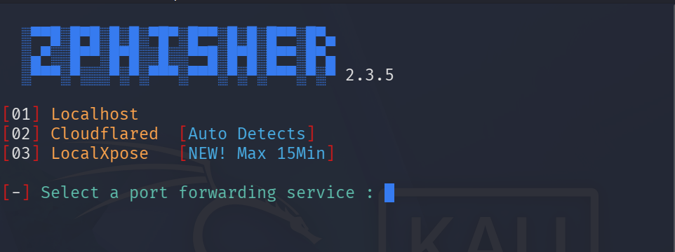
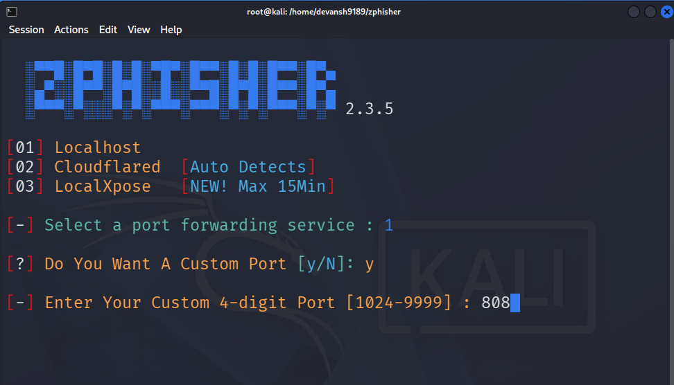
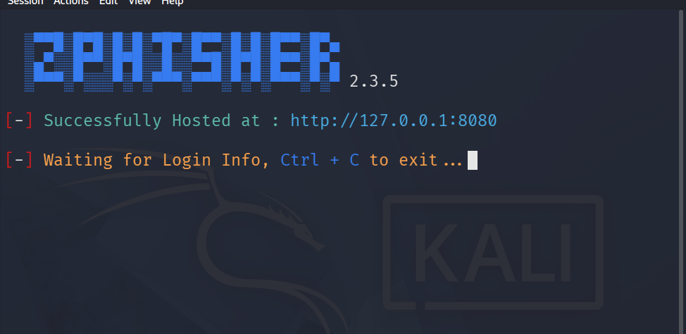
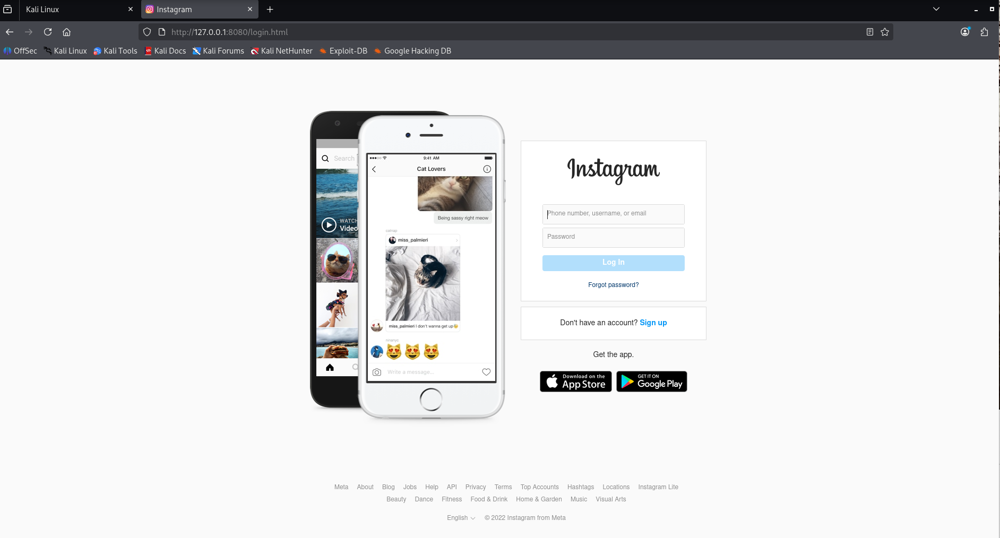

# ⚠️ Disclaimer: Only for Educational purposes. 
---

## 💣 Phishing Attack using Zphisher Tool 

We will create a simulated login page environment using a pre-built template to understand how phishing attacks work and how attackers attempt to trick users into entering credentials. This will help in learning about phishing techniques and developing better security awareness and defenses.

---

# Getting Pre-built Templates:
First, we need ready-made login pages for faster execution. To achieve this, we will use a GitHub project that contains pre-built login page templates that are ready to use. This will save development time and allow us to focus on further implementation and testing. 
``` bash
git clone --depth=1 https://github.com/htr-tech/zphisher.git
```
This has all pre-built templates.

# 🖥️ Open Kali-linux Terminal
## 1: Get User Access
To get user access we use command:
```
sudo su
```
Once you enter the provided credentials, you will be prompted to enter your Kali Linux username and password. While typing the password, no characters will be displayed on the terminal, which is a normal security feature in Linux systems.

After entering the correct password, you will gain access to the user's directory and see the command prompt with your username. If the password is incorrect, the system will display a "Permission denied" message.
## 2: 🔀Cloning the Pre-built Templates into your system
In the terminal, copy and paste the GitHub repository link and press Enter. The system will start cloning the project files (templates) into your local system.

Once the process is completed successfully, a message indicating that the repository has been cloned successfully will appear, such as "Cloning into 'zphisher.git'..." followed by the completion message.

## 3: 🎬 Ready to Start
### Step-1: 
To access the **zphisher** directory, use the following command:

```bash
cd zphisher
```

After running this command, the terminal directory will change from your current username directory to the **username/zphisher** directory.

To view the files available inside the directory, use:

```bash
ls
```

This command will display the list of files and folders present in the directory. Locate the **zphisher.sh** file from the list.


### Step-2:
To execute the shell script, use the Bash command:

```bash
bash zphisher.sh
```

This will run the script and start the program.


After running the shell script, the program will process the required files and may take a few minutes to load.

Once the process is completed, a list of different social media platforms will be displayed along with corresponding numeric options. Select the required option by entering its assigned number.


After selecting the platform, different templates will be shown. Choose the appropriate template from the available options.


### Step-3: 
Choosing the Network
After this step, you will see three network options:

1. **Localhost**

   * This option allows access only to devices connected to the same local network.
   * It uses a local web server (such as Apache) to host the page within the local environment.

2. **Cloudflare Tunnel**

   * This option creates a connection between your local server and the public internet using Cloudflare's tunneling service.
   * It allows access from outside the local network through a generated URL.
   * Different URL options may be available depending on the configuration.

3. **LocalXpose**

   * LocalXpose creates a secure tunnel that forwards traffic from the public internet to a local service.
   * It is commonly used for legitimate purposes such as testing, development, and sharing local applications remotely.
   * A public URL is generated to access the locally hosted service.

These tunneling options should be used only in authorized environments, such as personal labs or approved security testing, to avoid exposing or impersonating unauthorized services.
 


Selecting the Port

After choosing the network option, the tool will ask whether you want to use a custom port or a randomly assigned port.

If you want to use a custom port, select Y and enter the required port number.
If you want the tool to select a port automatically, select N.



After the port configuration is completed, the local service will start and generate a URL for accessing the hosted page. The terminal will display the generated URL along with a status message "Waiting for Login Info".



### Step-4:
When a generated URL is opened in a browser, it can display a page that imitates a legitimate website interface. 





In real-world phishing attacks, attackers try to convince users that the page is genuine and may attempt to collect entered credentials.

After a user submits information, a phishing page may redirect them to the original website to make the activity appear normal, while the collected data could be misused by an attacker. 


