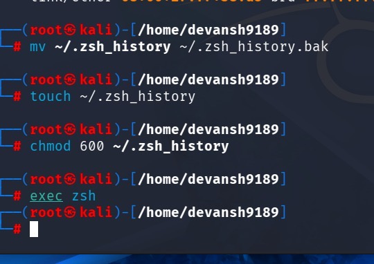

**There was a corrupted Zsh history file, which I fixed by clearing the history and restarting the terminal session** 


For resloving the issue there are few commands. 
```
mv ~/.zsh_history ~/.zsh_history.bak
```
* mv = move or rename a file.
* ~/.zsh_history = your current Zsh history file.
* ~/.zsh_history.bak = backup file.
```
touch ~/.zsh_history
```
* touch: creates a new empty file if it doesn't exist.
```
chmod 600 ~/.zsh_history
```
* chmod changes file permissions.
* 600 means:
     * Owner: Read + Write (rw-)
     * Group: No permissions (---)
     * Others: No permissions (---)

 ```
exec zsh
```
* exec replaces the current shell process with a new one
* zsh starts a fresh Zsh session.
    

