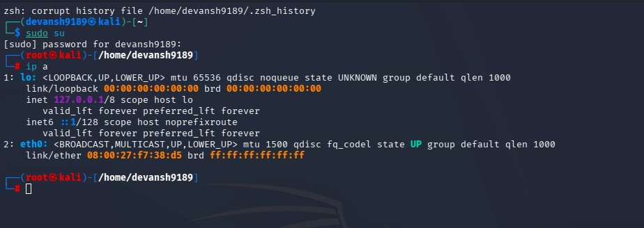

# Troubleshooting Internet Connection Issue
I was having trouble getting an internet connection in VirtualBox on my M2 Mac, even though my host system was connected to Wi-Fi. I tried using a Bridged Adapter, but **DHCP completely failed** to assign an IP address. After trying various fixes, I finally resolved it by manually configuring a **static IP** inside the VM.

### 📸 Here, I have attached all the screenshots showing the issues I encountered and the steps I followed to successfully resolve them.
I received valuable guidance and support from my professional instructor.
### Firstly:
I checked the ip address 
```
ip a
```




