# Troubleshooting Internet Connection Issue
I was having trouble getting an internet connection in VirtualBox on my M2 Mac, even though my host system was connected to Wi-Fi. I tried using a Bridged Adapter, but **DHCP completely failed** to assign an IP address. After trying various fixes, I finally resolved it by manually configuring a **static IP** inside the VM.

### 📸 Here, I have attached all the screenshots showing the issues I encountered and the steps I followed to successfully resolve them.
I received valuable guidance and support from my professional instructor.
### Checking IP address
I checked the ip address 
```
ip a
```


---

### Asking IP address
Using dhclient for asking router for IP Address
```
dhclient -v eth0
```
* dhclient = Get IP address
* -v = Show details
* eth0 = Network adapter

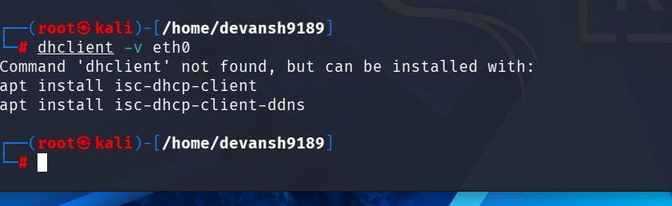

But as you can see it says command 'dhclient' not found, so need to install **DHCP Client**. 

Steps to Follow: 
```
sudo apt install isc-dhcp-client
```
**This will install DHCP CLient**

```
sudo apt install-dhcp-client-ddns
```

But in my terminal after running first command but Error occurred:failed to fetch the dhcp client 

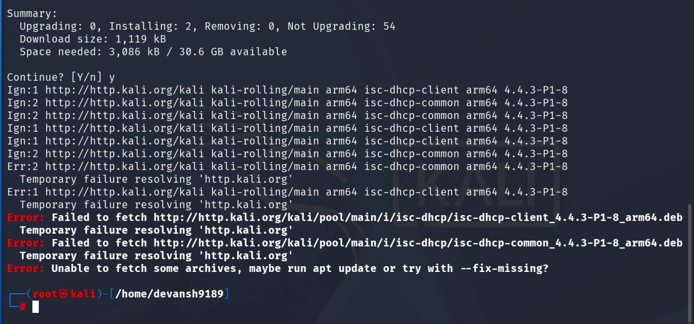

---

### Trying to reach another device over same network 
For that need i tried 
```
ping 8.8.8.8
```
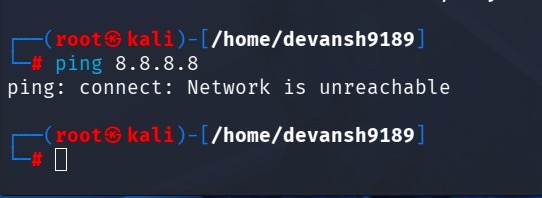

But Failed to connect another device as Network was unreachable 

Then used 
```
ip route
```
But didn't return that routing table or any gateway as network was unreachable 

So,

```
iwconfig
```
* lo = Loopback interface (your own computer)
* eth0 = Wired Ethernet interface
* "no wireless extensions" = eth0 is not a Wi-Fi adapter

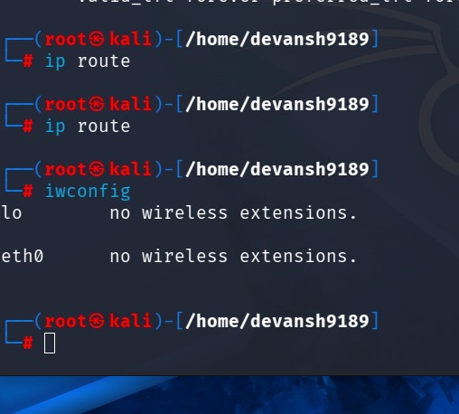

---

### Checking Network Status
Using Network Manager Command Line Interface to network status. 
```
nmcli device status
```
* nmcli manages/ check network connection in terminal
* device is network device like eth0
* status gives current status of the network device.

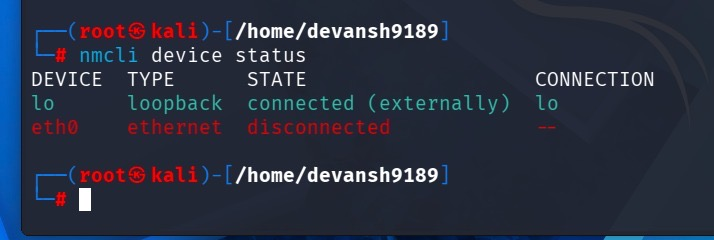

As you can see, **eth0  ethernet  disconnected** so that, Kali Linux VM can see the network adapter (eth0), but it is not connected to any network.

**Then setting up eth0**

```
ip link set eth0 up
```

* ip Internet Protocol
* link Network link/ interface management
* set Change a configuration
* eth0 Ethernet Interface #0.
* up Administrative state: ON.

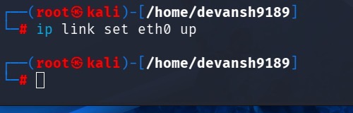  

Now its On. 

---

### NetworkManager Status 
Firstly checked the NetworkManager is active or unactive. 

```
systemctl status NetworkManager
```

this will give status of Network Manager services 

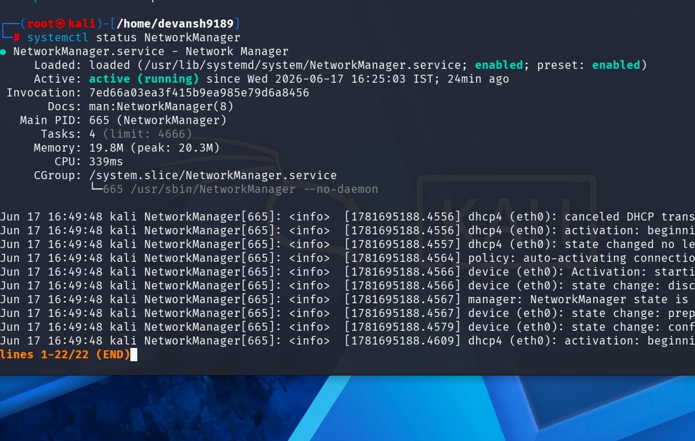  

What it is saying:
* Loaded: loaded (... enabled): This means the system knows what NetworkManager is, and it is set to start up automatically every time you boot up your computer.
* Active: active (running): The service is currently alive and active. It is actively managing your connections right now.
* device (eth0): Activation: starting: NetworkManager noticed you turned eth0 on and is trying to get it fully connected to your network.
* dhcp4 (eth0): activation: beginning: It is currently talking to your internet router to ask for a local IP address (using a system called DHCP) so you can actually browse the web.

Tried to restart it so, 

```
systemclt restart NetworkManager
```

After that, checked the network status again. 
```
nmcli device status
```
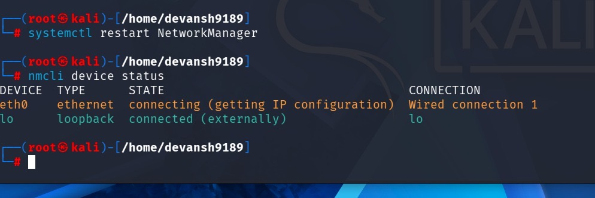  

What it is saying: 
* Its status is connecting (getting IP configuration): it is currently sitting at the counter waiting for your internet router to hand it an IP address.

 --- 

 ### Tried changing the Adapters

* Settings → Network
* Adapter 1 → Enable Network Adapter
* Attached to: Bridged Adapter or NAT

Then restarted the VM.

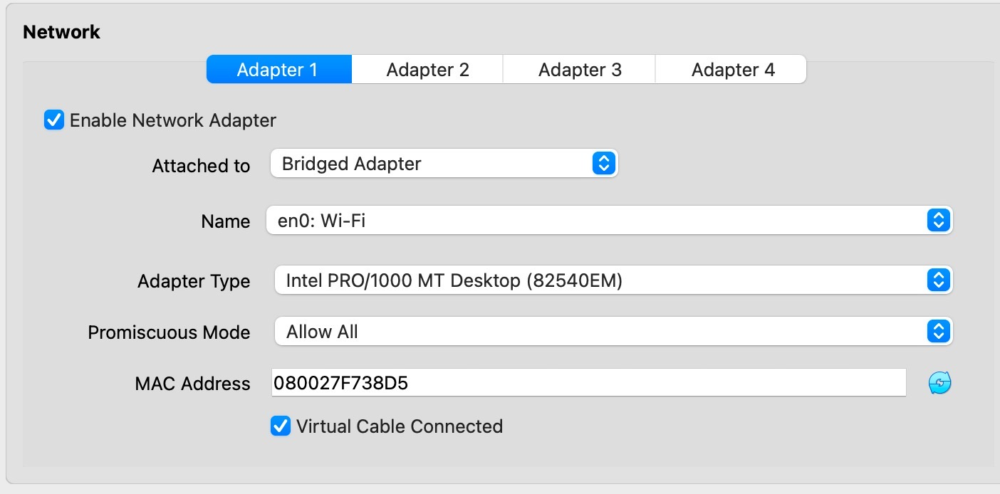  

---

### Forced the system to drop current network 

Stopped the current connection and rebuild a new connection.
```
nmli connection down "Wired Connection 1
```
Once its Successfully Deactivated, and Reconnect to fresh new connection 
```
nmli connection up "Wired Connection 1"
```
New Connection activated Successfully 

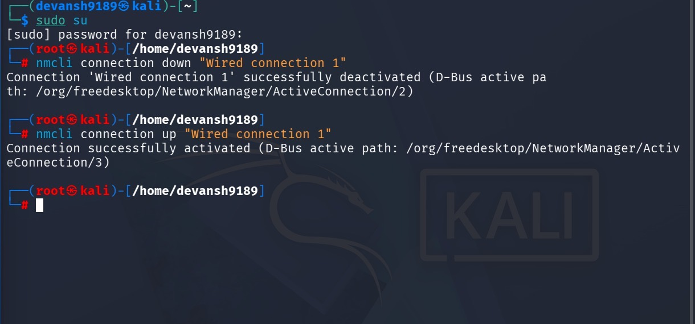  

---

### Finally Got Internet Address Configuration on **NAT Adapter**  

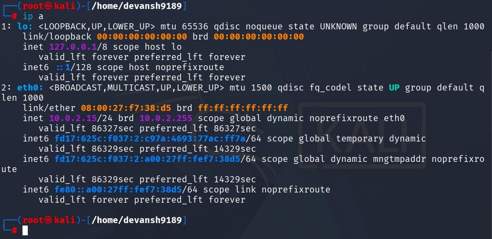 

**inet 10.0.2.15/24**: This was the big success! router has officially handed machine a **local IPv4 Address (10.0.2.15)**. officially on the network.

Internet connection is ON and traffic is flowing out to the real world!


**My machine has full, working internet access!**

---

### Checked internal system IP address
```
ifconfig eth0
```
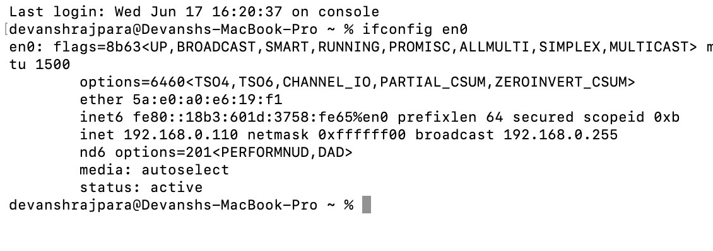 


### Switched to Bridged Adapter and Give Static IP Manually

```
sudo su addr add 192.168.0.200/24 dev eth0
```

This allocates a static IP 192.168.0.200. 

Now, gave a default route
```
sudo ip route add default via 192.168.0.1
```

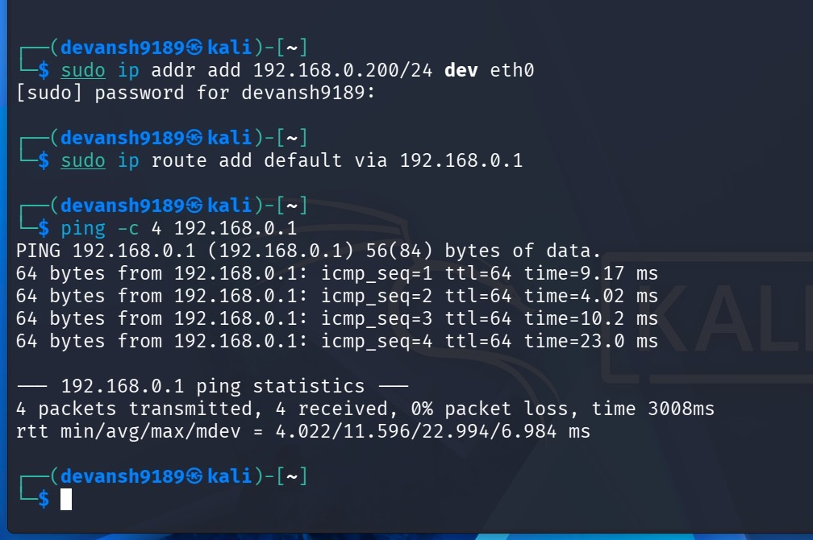 


### Finally Checked the Internet Connection 

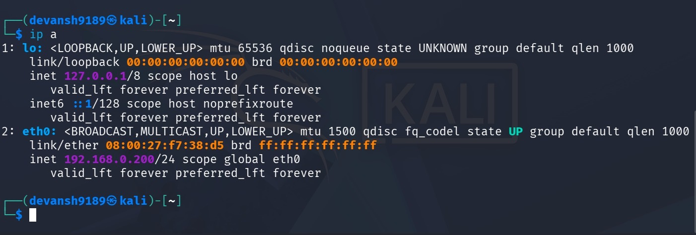 

Now there you can see there is Internet Now


